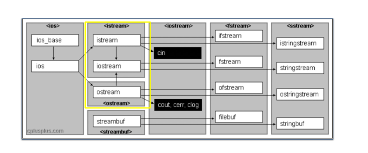
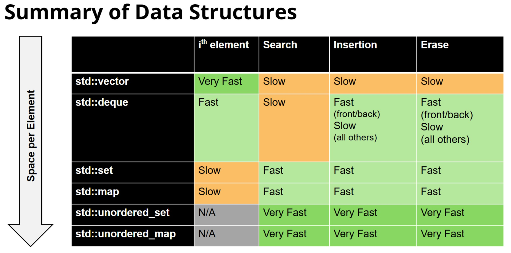

# CS106L

## stream

流是一通用的c++I/O抽象

抽象指隐藏不必要的细节，只暴露相关部分，提供一致接口

ios_base是所有流相关功能的基础

维护：

​	状态信息

​	控制信息

这些用于确保流的正常

状态信息告诉流的状态（failbit/eofbit)

basic_ios建立在ios_base上

ostream 与 istream 建立在 basic_ios 上

分别包含字符串，文件和标准流的输入输出流

ostringstream ：输出字符串流，用于把数据写入字符串中。

istringstream ：输入字符串流，从字符串中提取数据到其他变量中。

ifstream：文件输入流，从文件中提取数据

ofstream：文件输出流，输出数据到文件

ostream与istream的交集为iostream，包含4个标准流


流允许以通用方式处理外部数据

标准流的导入流程如下：




创建一个字符串流后，>> 提取操作从字符串的开头开始读取。

```C++
//>> 流提取操作符
//完成提取操作后，它会返回流本身
int SToInt(const string& i);
int main() {
	string str;
	cin >> str;
	ostringstream oss;
	oss << SToInt(str);
	cout << oss.str() << endl;
}
int SToInt(const string& i) {
	istringstream iss(i);
	int result;
	char remain;
	//>>流提取操作符返回的流隐式转换为bool类型，表示流是否处于有效状态
	if (!(iss >> result) || (iss >> remain)) {
		throw domain_error("Invalid input: " + i);
	}
	return result;
}
```

cin : 标准输入流

cout : 标准输出流

cerr : 标准错误流，立即发送错误（无缓冲）

clog : 标准日志流，非关键事件日志记录（有缓冲）

**>>**与**<<**

**使用cin与>>组合的弊端**

**1. cin 会将整行内容读入缓冲区，但只提供给你以空白字符分隔的标记（token）。**

**2. 缓冲区中的残留数据（垃圾数据）会导致 cin 无法在正确的时间提示用户输入。**

**3. 当 cin 发生错误时，所有后续的 cin 操作也都会失败。**

getline ：获取行函数，读取一整行直到\n，会消耗 '\n'


```c++
string name;
getline(cin, name);
```

不要将 >> 与 getline 混用，>>会保留'\n'符使getline失效，进而导致上述第 **2** 点问题（缓冲区残留数据）

使用 **cin.ignore()** 来忽略单个字符

getline同样返回一个流

```c++
//实现标准库中的getInteger
int getInt(const string& prompt,const string& reprompt) {
	while (true) {
		cout << prompt;
		string line;
		if(!getline(cin, line)) {
			throw domain_error("Input error");
		}
		istringstream iss(line);
		int result;
		char remain;
		if(iss>>result && !(iss >> remain)) {
			return result;
		}
		cout << reprompt << endl;
	}
}
```


另一种做法，清理整个缓冲区

**cin.clear()** 重置流的状态

**刷新缓冲区的时机**：

1. 显式刷新（如 std::endl / std::flush）；

2.当程序执行到末尾

3.当缓冲区已满

4.当关联的流相互作用

**auto** :关键字，编译器自动判断变量类型

**auto的好处**


- **正确性**：使用 `auto` 可以确保变量被正确初始化（因为 `auto` 必须初始化才能推导类型），从而避免未初始化变量带来的 bug；同时能避免隐式类型转换导致的数据截断或精度丢失。

- **灵活性**：如果以后把某个变量从 `int` 改成 `long` 或自定义类型，使用 `auto` 的代码不需要手动修改类型声明，维护起来更加方便。


**使用auto应遵循的良好准则：**

- **当从上下文能清楚看出类型时使用它。**
- **当具体类型并不重要时使用它。**
- **当它明显损害可读性时，不要使用它。**
- **在 CS 106B 课程中不要使用 auto。**
- 尽量别在头文件使用

```c++
//使用auto简化代码
//pair<int,int> [min,max] 变为 auto [min,max]
//原调用需使用pair<int,int> p; cout << p.first << " " << p.second << endl;
pair<int,int> A(int dist){
	int min=10*dist;
	int max=100*dist;
	return make_pair(min,max);
}
int main(){
    int a=10;
    auto [min,max]=A(a);
    cout << min << " " << max << endl;
}
```

**参数与返回值类型的选用时机**

> 原图为现代 C++ “参数与返回值选用”决策图（*Parameters (in) and return values (out) guidelines for modern C++ code*，2019），整理为下表：

| 场景 | 条件 | 建议写法 | 示例类型 |
| --- | --- | --- | --- |
| In（输入参数） | 拷贝成本低，或不可拷贝 | `f(x)` 按值传递 | `int`、`unique_ptr` |
| In（输入参数） | 移动成本低或适中 | `f(x)` 按值传递（需保留副本时用 `std::move`） | `vector<T>`、`string`、`array<vector>`、`BigPOD` |
| In（输入参数） | 移动成本高，或类型未知 | `f(const T&)` 常量引用 | `BigPOD[]`、`array<BigPOD>`、陌生类型/模板 |
| In/Out（输入输出参数） | 需要修改传入的对象 | `f(T&)` 非常量引用 | — |
| Out（输出参数） | 返回结果 | 优先通过返回值返回 | — |

> 注意：不带 `const` 的引用参数意味着它是 in/out（输入输出）参数！

现代c++编译器存在返回值优化机制（RVO）

 **统一初始化（uniform initialization）** ：用花括号 {} 提供参数列表来初始化对象（这是一种初始化语法，并非所有对象都有初始化列表构造函数）

```c++
//所有对象可通过uniform（统一初始化）来初始化
struct Course {
	string a;
	int b;
	vector<int> c; 
};
int main(){
	Course test{"name", 42, {3,4,5,6}};
}
```

vector传入一个参数表示大小

不应当认为c++会将局部变量null初始化

**使用stringstream的时机**：

处理字符串

格式化输入输出（使用 uppercase、hex、endl、flush 等流控制符）

解析不同类型


多使用STL标准库中的内容

## sequence container

STL标准库包含五个核心部分：

**容器** ，**适配器，** **迭代器，** **算法，** **函数与 lambda 表达式**

另一个开源库boost

**vector<T>**

可调整大小的连续数组

扩容时，创建一个双倍原大小的数组，将原数组的数据迁移后销毁原数组

使用方括号表示法在STL库中不会进行越界检查

即该方法发生越界访问时，如果访问内存未受保护不会抛出段错误

使用 .at() 会进行越界检查

vector的优点：快速，轻量

缺点：前端插入极不方便

**deque<T>双端队列**

本质是由固定长度的数组构成的数组，与向量相似，但是能在常数时间内向前端大量插入数据

在访问变量时速度比vector慢

stack 底层是功能受限的 deque 或 vector，queue 底层是功能受限的 deque；stack 只允许 push_back 和 pop_back，queue 只允许 push_back 和 pop_front

**c++的设计原则：**

清晰的意图和明确的目的

将杂乱的构造进行分隔

不浪费时间和空间

允许程序员在需要时拥有完全的控制权、责任和选择权

尽可能在编译期强制保证安全性


 故 stack 和 queue 称为 vector 与 deque 的 container adapter（容器适配器），它们只是限制底层容器的功能，速度与底层容器相同（零开销抽象）

## Associative Containers

包括 map<T1,T2>（映射） ，set<T>（集合） ，unordered_map<T1,T2> ,unordered_set<T>（无序容器）

map 是 pair（有序对）的集合

底层实现为红黑树，故查找/插入/删除的时间复杂度为 O(logn)（遍历仍是 O(n)）


set 是没有值的map，故元素唯一

map 与 set 会按键的排序副本对元素进行排序（副本不一定是数组）

因为 map 与 set 使用红黑树实现，故键的类型必须是可比较的

第3个参数是键比较器，默认为std::less（<），键值不可比较时需重载 < 

事实上，map 模板包含第4个参数 allocator（内存分配器），但是使用时无需关心，它包含默认的内存管理器


无序容器使用 hash 排列，即遍历时元素不为有序

无序 map 包含额外的两个参数为：Hash 与 Key_Equal，默认为 std::hash<key>，std::equal_to<key>（operator==)

这两个参数保证键的唯一性，若键需使用自定义的类，则需添加自定义的 hash 函数并重载操作符==


map 与set 遍历的速度更快，unordered_map，unordered_set 在通过键访问元素的速度更快

无法通过索引0，1等访问map 和 set，但是它们仍然是排序过的

**访问元素方法：**map[key]， map.at(key);

方括号表示法会在无此键时自动创建一个条目，at()函数会抛出错误

**判断键的存在：**map.count()，迭代器

count()函数会检查指定键的数量，但在map中返回0或1

C++20 中包含 contains 函数判断


set可以视为一个map，包含一个隐式的值为true或false

故 map 的所有函数几乎可以用于 set ，除了使用到键的方括号表示和 at()

## Iterators（迭代器）

map 与 set 这类容器元素按键排序但无法用下标索引访问，但仍可用迭代器或范围 for 循环遍历

迭代器库是允许对任何容器迭代的库

**迭代器是允许以线性方式观察任何容器的装置**

迭代器类型取决于指向的容器类型，类似set<int>::iterator 是整数集合迭代器

对顺序容器，它的迭代器底层是指针

可以将迭代器理解为内存地址，与指针稍有不同

**4大迭代器基本操作：**

.begin()	获取该容器的迭代器，它指向容器的首元素

*iterator	解引用，获取迭代器指向的值

++	迭代器递增，读取下个元素

.end()	获取容器末端后一个元素的迭代器，这个迭代器指向的位置永远为空，用于判断迭代器是否到达容器末尾

所有迭代器包含以上4个操作，大多数迭代器提供更多操作

```c++
//以下c++11的语法糖的底层为第二段代码
//使用迭代器遍历容器
for (auto elem : s)
{
    std::cout << elem;
}
for (auto it = s.begin(); it != s.end(); ++it) {
    auto elem = *it;
    std::cout << elem;
}
```


迭代器允许以标准化的方式阅读任何容器，抽象容器的具体类型

++a 与 a++ 的区别：++a 返回新值的引用，a++ 返回旧值的副本（按值返回）

++a 的速度不会慢于 a++，故应当使用++a 替代 a++

每个容器内部使用 using 定义 iterator 为容器类的迭代器别名

使用  auto 来避免过长的迭代器类型名

迭代器类型决定功能

**分为5类：**

输入，前向，双向，随机访问（这4类中后一类以前一类为基础），输出


输入是最基础的迭代器，允许读取元素

如输入流迭代器std::istream_iterator<T>;

输出允许写入元素

输出流迭代器 std::ostream_iterator<T>;

前向是一个允许多次遍历的输入迭代器

包含所有的STL容器的迭代器


双向是允许向前和向后移动的迭代器

map 与 set 的迭代器

以前向迭代器为基础，并支持向后移动


随机访问是允许快速向前与向后跳跃的迭代器

vector 和 deque的迭代器

以双向为基础

不同算法的实现必须使用不同的迭代器以满足要求


不同的迭代器为所有容器提供统一的抽象

注意：不同的容器实现方式影响它的迭代方式


**容器的属性对比**



**指针与内存**

迭代器指向容器元素。指针指向任何对象


内存通常是字节可寻址的，对象的地址是其最低字节的位置

指针指向变量的地址

事实上，迭代器拥有与指针相似的接口

vector迭代器就是原型指针 T* 的别名（STL的真正实现不是 T*，但是可以认为 vector 的迭代器操作就是指针操作）

