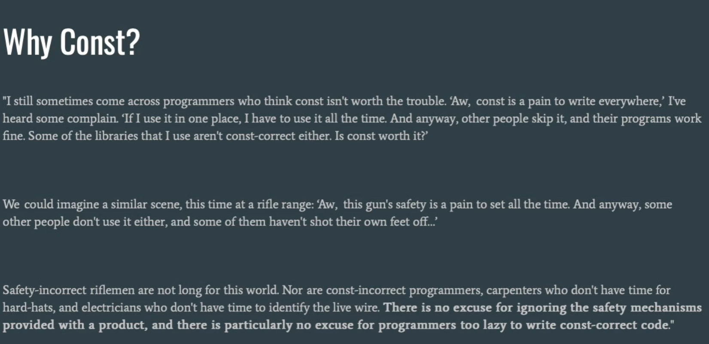

# CS106L

## stream

流是一通用的c++I/O抽象

抽象指隐藏不必要的细节，只暴露相关部分，提供一致接口

ios_base是所有流相关功能的基础

维护：

​	状态信息

​	控制信息

这些用于确保流的正常

状态信息告诉流的状态（failbit/eofbit)

basic_ios建立在ios_base上

ostream 与 istream 建立在 basic_ios 上

分别包含字符串，文件和标准流的输入输出流

ostringstream ：输出字符串流，用于把数据写入字符串中。

istringstream ：输入字符串流，从字符串中提取数据到其他变量中。

ifstream：文件输入流，从文件中提取数据

ofstream：文件输出流，输出数据到文件

ostream与istream的交集为iostream，包含4个标准流


流允许以通用方式处理外部数据

标准流的导入流程如下：


创建一个字符串流后，>> 提取操作从字符串的开头开始读取。

```C++
//>> 流提取操作符
//完成提取操作后，它会返回流本身
int SToInt(const string& i);
int main() {
	string str;
	cin >> str;
	ostringstream oss;
	oss << SToInt(str);
	cout << oss.str() << endl;
}
int SToInt(const string& i) {
	istringstream iss(i);
	int result;
	char remain;
	//>>流提取操作符返回的流隐式转换为bool类型，表示流是否处于有效状态
	if (!(iss >> result) || (iss >> remain)) {
		throw domain_error("Invalid input: " + i);
	}
	return result;
}
```

cin : 标准输入流

cout : 标准输出流

cerr : 标准错误流，立即发送错误（无缓冲）

clog : 标准日志流，非关键事件日志记录（有缓冲）

**>>**与**<<**

**使用cin与>>组合的弊端**

**1. cin 会将整行内容读入缓冲区，但只提供给你以空白字符分隔的标记（token）。**

**2. 缓冲区中的残留数据（垃圾数据）会导致 cin 无法在正确的时间提示用户输入。**

**3. 当 cin 发生错误时，所有后续的 cin 操作也都会失败。**

getline ：获取行函数，读取一整行直到\n，会消耗 '\n'


```c++
string name;
getline(cin, name);
```

不要将 >> 与 getline 混用，>>会保留'\n'符使getline失效，进而导致上述第 **2** 点问题（缓冲区残留数据）

使用 **cin.ignore()** 来忽略单个字符

getline同样返回一个流,但是它可以隐式转换为bool

```c++
//实现标准库中的getInteger
int getInt(const string& prompt,const string& reprompt) {
	while (true) {
		cout << prompt;
		string line;
		if(!getline(cin, line)) {
			throw domain_error("Input error");
		}
		istringstream iss(line);
		int result;
		char remain;
		if(iss>>result && !(iss >> remain)) {
			return result;
		}
		cout << reprompt << endl;
	}
}
```


另一种做法，清理整个缓冲区

**cin.clear()** 重置流的状态

**刷新缓冲区的时机**：

1. 显式刷新（如 std::endl / std::flush）；

2.当程序执行到末尾

3.当缓冲区已满

4.当关联的流相互作用

**auto** :关键字，编译器自动判断变量类型

**auto的好处**


- **正确性**：使用 `auto` 可以确保变量被正确初始化（因为 `auto` 必须初始化才能推导类型），从而避免未初始化变量带来的 bug；同时能避免隐式类型转换导致的数据截断或精度丢失。

- **灵活性**：如果以后把某个变量从 `int` 改成 `long` 或自定义类型，使用 `auto` 的代码不需要手动修改类型声明，维护起来更加方便。


**使用auto应遵循的良好准则：**

- **当从上下文能清楚看出类型时使用它。**
- **当具体类型并不重要时使用它。**
- **当它明显损害可读性时，不要使用它。**
- **在 CS 106B 课程中不要使用 auto。**
- 尽量别在头文件使用

```c++
//使用auto简化代码
//pair<int,int> [min,max] 变为 auto [min,max]
//原调用需使用pair<int,int> p; cout << p.first << " " << p.second << endl;
pair<int,int> A(int dist){
	int min=10*dist;
	int max=100*dist;
	return make_pair(min,max);
}
int main(){
    int a=10;
    auto [min,max]=A(a);
    cout << min << " " << max << endl;
}
```

**参数与返回值类型的选用时机**

> 原图为现代 C++ “参数与返回值选用”决策图（*Parameters (in) and return values (out) guidelines for modern C++ code*，2019），整理为下表：

| 场景 | 条件 | 建议写法 | 示例类型 |
| --- | --- | --- | --- |
| In（输入参数） | 拷贝成本低，或不可拷贝 | `f(x)` 按值传递 | `int`、`unique_ptr` |
| In（输入参数） | 移动成本低或适中 | `f(x)` 按值传递（需保留副本时用 `std::move`） | `vector<T>`、`string`、`array<vector>`、`BigPOD` |
| In（输入参数） | 移动成本高，或类型未知 | `f(const T&)` 常量引用 | `BigPOD[]`、`array<BigPOD>`、陌生类型/模板 |
| In/Out（输入输出参数） | 需要修改传入的对象 | `f(T&)` 非常量引用 | — |
| Out（输出参数） | 返回结果 | 优先通过返回值返回 | — |

> 注意：不带 `const` 的引用参数意味着它是 in/out（输入输出）参数！

现代c++编译器存在返回值优化机制（RVO）

 **统一初始化（uniform initialization）** ：用花括号 {} 提供参数列表来初始化对象（这是一种初始化语法，并非所有对象都有初始化列表构造函数）

```c++
//所有对象可通过uniform（统一初始化）来初始化
struct Course {
	string a;
	int b;
	vector<int> c; 
};
int main(){
	Course test{"name", 42, {3,4,5,6}};
}
```

vector传入一个参数表示大小

不应当认为c++会将局部变量null初始化

**使用stringstream的时机**：

处理字符串

格式化输入输出（使用 uppercase、hex、endl、flush 等流控制符）

解析不同类型


多使用STL标准库中的内容

## sequence container

STL标准库包含五个核心部分：

**容器** ，**适配器，** **迭代器，** **算法，** **函数与 lambda 表达式**

另一个开源库boost

**vector<T>**

可调整大小的连续数组

扩容时，创建一个双倍原大小的数组，将原数组的数据迁移后销毁原数组

使用方括号表示法在STL库中不会进行越界检查

即该方法发生越界访问时，如果访问内存未受保护不会抛出段错误

使用 .at() 会进行越界检查

vector的优点：快速，轻量

缺点：前端插入极不方便

**deque<T>双端队列**

本质是由固定长度的数组构成的数组，与向量相似，但是能在常数时间内向前端大量插入数据

在访问变量时速度比vector慢

stack 底层是功能受限的 deque 或 vector，queue 底层是功能受限的 deque；stack 只允许 push_back 和 pop_back，queue 只允许 push_back 和 pop_front

**c++的设计原则：**

清晰的意图和明确的目的

将杂乱的构造进行分隔

不浪费时间和空间

允许程序员在需要时拥有完全的控制权、责任和选择权

尽可能在编译期强制保证安全性


 故 stack 和 queue 称为 vector 与 deque 的 container adapter（容器适配器），它们只是限制底层容器的功能，速度与底层容器相同（零开销抽象）

## Associative Containers

包括 map<T1,T2>（映射） ，set<T>（集合） ，unordered_map<T1,T2> ,unordered_set<T>（无序容器）

map 是 pair（有序对）的集合

底层实现为红黑树，故查找/插入/删除的时间复杂度为 O(logn)（遍历仍是 O(n)）


set 是没有值的map，故元素唯一

map 与 set 会按键的排序副本对元素进行排序（副本不一定是数组）

因为 map 与 set 使用红黑树实现，故键的类型必须是可比较的

第3个参数是键比较器，默认为std::less（<），键值不可比较时需重载 < 

事实上，map 模板包含第4个参数 allocator（内存分配器），但是使用时无需关心，它包含默认的内存管理器


无序容器使用 hash 排列，即遍历时元素不为有序

无序 map 包含额外的两个参数为：Hash 与 Key_Equal，默认为 std::hash<key>，std::equal_to<key>（operator==)

这两个参数保证键的唯一性，若键需使用自定义的类，则需添加自定义的 hash 函数并重载操作符==


map 与set 遍历时元素有序，unordered_map，unordered_set 在通过键访问元素的速度更快（O(1)）

无法通过索引0，1等访问map 和 set，但是它们仍然是排序过的

**访问元素方法：**map[key]， map.at(key);

方括号表示法会在无此键时自动创建一个条目，at()函数会抛出错误

**判断键的存在：**map.count()，迭代器

count()函数会检查指定键的数量，但在map中返回0或1

C++20 中包含 contains 函数判断


set可以视为一个map，包含一个隐式的值为true或false

故 map 的所有函数几乎可以用于 set ，除了使用到键的方括号表示和 at()

## Iterators（迭代器）

map 与 set 这类容器元素按键排序但无法用下标索引访问，但仍可用迭代器或范围 for 循环遍历

迭代器库是允许对任何容器迭代的库

**迭代器是允许以线性方式观察任何容器的装置**

迭代器类型取决于指向的容器类型，类似set<int>::iterator 是整数集合迭代器

对顺序容器，它的迭代器底层是指针

可以将迭代器理解为内存地址，与指针稍有不同

**4大迭代器基本操作：**

.begin()	获取该容器的迭代器，它指向容器的首元素

*iterator	解引用，获取迭代器指向的值

++	迭代器递增，读取下个元素

.end()	获取容器末端后一个元素的迭代器，这个迭代器指向的位置永远为空，用于判断迭代器是否到达容器末尾

所有迭代器包含以上4个操作，大多数迭代器提供更多操作

```c++
//以下c++11的语法糖的底层为第二段代码
//使用迭代器遍历容器
//foreach循环
for (auto elem : s)
{
    std::cout << elem;
}
for (auto it = s.begin(); it != s.end(); ++it) {
    auto elem = *it;
    std::cout << elem;
}
```


迭代器允许以标准化的方式阅读任何容器，抽象容器的具体类型

++a 与 a++ 的区别：++a 返回新值的引用，a++ 返回旧值的副本（按值返回）

++a 的速度不会慢于 a++，故应当使用++a 替代 a++

每个容器内部使用 using 定义 iterator 为容器类的迭代器别名

使用  auto 来避免过长的迭代器类型名

迭代器类型决定功能

**分为5类：**

输入，前向，双向，随机访问（这4类中后一类以前一类为基础），输出


输入是最基础的迭代器，允许读取元素

只能递增，只读

如输入流迭代器std::istream_iterator<T>;

输出允许写入元素，只能递增，只写

输出流迭代器 std::ostream_iterator<T>;

前向是一个允许多次遍历的输入迭代器

包含所有的STL容器的迭代器


双向是允许向前和向后移动的迭代器

map 与 set 的迭代器，函数 reverse（反转）也会用到

以前向迭代器为基础，并支持向后移动


随机访问是允许快速向前与向后跳跃的迭代器

vector 和 deque的迭代器

以双向为基础

可以视为指针代表的接口

不同算法的实现必须使用不同的迭代器以满足要求


不同的迭代器为所有容器提供统一的抽象

注意：不同的容器实现方式影响它的迭代方式


**容器的属性对比**


**指针与内存**

迭代器指向容器元素。指针指向任何对象


内存通常是字节可寻址的，对象的地址是其最低字节的位置

指针指向变量的地址

事实上，迭代器拥有与指针相似的接口

vector迭代器就是原型指针 T* 的别名（STL的真正实现不是 T*，但是可以认为 vector 的迭代器操作就是指针操作）

**multimaps**

允许添加多个相同的键对应多个不同的值的 map

不能使用方括号表示法，使用 .insert 接收一个 pair 插入元素


auto iterators 使用是风格问题，与正常显式标注无区别

.distance() 查看当前迭代器与起始迭代器的距离，适用于任何容器

索引只适用于连续内存的容器


map iterator 的迭代器类型实质是pair<string,int> 类型的迭代器

创建 pair 的方式：

统一初始化

std::make_pair(a1, a2) 函数

map 解引用返回 pair ，pair.first访问键，pair.second访问值

认为指针是一种迭代器

**迭代器的其他用途：**

排序（.sort() ），查找元素

另一种查找容器中元素的方式：std::find(c.begin(), c.end(), elem);

如果不存在，返回 c.end();

注意：对 map/set 而言，应优先用成员 .find() 与 .count()（O(log n)），它们比自由函数 std::find（O(n) 线性扫描）更快


std::lower_bound(c.begin(), c.end(), elem)	返回第一个不小于（>=）elem 的元素，迭代器范围默认为 .begin 和 .end

std::upper_bound()	对应的，返回第一个大于（>）elem 的元素

 

c++中排序对较小的数据使用插入排序，较大的数据使用快速排序

迭代器的本质是内存地址，但是它有一个额外的接口层

## template

 template 是关键字（不是操作符），模板在实例化（用具体类型替换模板参数）时才确定类型

模板的实例化方式：

显式实例化


模板在声明时不确定类型，当实例化时才确定类型

c++中尽量不要使用C字符串，比较C字符串可能导致不确定情况

C 字符串：

1. 元素类型是 `char`（或宽字符类型，如 `wchar_t`）；
2. 最后一个字符是 `'\0'`，用来标记字符串结束。

**与 `std::string` 的区别**

C++ 标准库提供了 `std::string`，它更安全、更方便：

| 特性          | C 字符串                 | `std::string`        |
| :------------ | :----------------------- | :------------------- |
| 内存管理      | 手动或固定数组           | 自动管理，可动态增长 |
| 长度获取      | `strlen` 遍历            | `size()` 常数时间    |
| 复制/拼接     | `strcpy`/`strcat` 易溢出 | `=`、`+` 等运算符    |
| 安全性        | 容易缓冲区溢出           | 相对安全             |
| 与 C API 交互 | 直接兼容                 | 可用 `c_str()` 转换  |


模板不会进行任何隐式类型转换

函数传参时，const 参数允许接收非const参数，反之不行

使用模板时，编写函数应包含尽可能少的假设，否则可能导致匹配的类型不满足模板函数要求


c++的一个设计哲学是它会给你接口，并告诉你它期望什么

模板的每个语句都可能包含隐式接口，它会隐式给出匹配类型的要求

编译器会强制指出不适用于模板的类型


## function and lambdas

对传入一些参数并返回 bool 的函数称为谓词函数。 如 a == b 等语句

故在模板函数中，在含有指定谓词语句的地方，可以改为传入谓词函数，以满足对多个特定条件的适配

类型 std::function 几乎包含所有函数类型

可以将要使用的谓词函数模板化， 使该谓词适配不同类型

 模板错误发生时，会指向源代码，即无法编译的确切行

谓词函数的限制在于它无法获取编译期未知的信息，例如使用一个不便于作为参数传入的变量值且不能使用全局变量，这种情况下出现的报错会指向模板，但是问题在于传入了无法编译的内容

c++11 前的解决方案是编写一个拥有谓词函数功能的类，它含有 () 操作符，即编写仿函数

另一种解决方案是 lambdas 表达式，定义轻量化函数，如下

```c++
auto func =[capture-clause](parameters)-> returned-valueType{
	//func body
}
```

这样可以很轻松的创建一个函数对象

由于c++ 没有 object 类型，使用lambda表达式创建函数对象时，编译器会为它创建一个类（但是不知道名字）

事实上，lambda函数是一个对象

返回值类型可不写，编译器会自动判断

实际上类似 c++11 前创建仿函数的方案

lambda函数会创建自己的作用域，capture-clause 的作用为捕获当前作用域的指定变量并让其在内部作用域可用

可以通过引用或值捕获参数，值方式会创建副本

变量捕获方式有很多种

使用 ‘=’ 会按值捕获所有内容（按引用捕获则用 &）

捕获语句允许使用默认参数


所有函数都可作为参数传递，本质是传递函数指针，传入函数名即可

## algorithms


- **Province of Value Queries（值查询省，左上）**：对应 `std::find`, `std::count`, `std::equal` 等。这类算法通常在区间内寻找特定值或满足条件的元素。
- **Province of Property Queries（属性查询省，中上）**：对应 `std::all_of`, `std::any_of`, `std::none_of`。它们不返回值，而是返回布尔值来描述区间内元素的整体属性。
- **Land of Queries（查询之地，左侧中）**：包括各种 `find` 变体（如 `find_if`, `find_if_not`）。
- **2-Ranges Properties（双区间属性，顶部）**：处理两个区间关系的算法。
- **Grand Duchy of Algos on Sets（集合算法大公国，右上）**：对应 `std::set_union`, `std::set_intersection`, `std::set_difference` 等集合操作。
- **Lonely Islands（孤独群岛，右上角）**：对应一些独立的、不依赖迭代器区间的算法，如 `std::min`, `std::max`, `std::clamp`。
- **Province of Research（研究省，中部）**：包含搜索类算法，如 `std::search`, `std::search_n`, `std::adjacent_find`。
- **Principality of Raw Memory（原始内存公国，正中央，带红色❌标志）**：对应 `std::uninitialized_copy`, `std::destroy` 等，这部分涉及底层内存操作，通常不建议普通开发者直接使用（红色❌暗示“危险”）。
- **Territory of Movers（移动者领地，右侧）**：对应 `std::move`, `std::swap` 等涉及移动语义的算法。
- **Islands of Structure Changers（结构改变者群岛，中下）**：对应 `std::remove`, `std::unique`, `std::reverse`, `std::rotate` 等会改变区间内元素顺序或结构的算法。
- **Land of Value Modifiers（值修改者之地，中右）**：对应 `std::replace`, `std::fill`, `std::transform` 等修改元素值的算法。
- **Land of Permutations（排列之地，左下）**：对应 `std::next_permutation`, `std::prev_permutation`, `std::shuffle` 等改变元素排列顺序的算法。
- **Secret Runes（秘密符文，左下边缘）**：可能对应 `<numeric>` 中的算法或C++17/20引入的新算法（如 `std::reduce`, `std::transform_reduce`，或 `std::sample`）。

适用于 c++17的图


一些常用算法

**`std::remove_if` (条件移除)**

**`std::sort` (全排序)**

**`std::stable_partition` (稳定分区)**：所有谓词返回 true 的元素置于开头，返回 false 的置于末尾

**`std::copy_if` (条件复制)**：查看一个范围，将所有满足条件的元素复制到另一个容器（接受参数是输出迭代器，于是可以向 cout 流输出内容），但是这个算法本身不能扩容容器

**`std::remove_if` (条件移除)**：移除所有满足谓词的变量，无法改变容器的大小。事实上，它无法从容器中删除元素，实际是将要移除的元素移动到容器交换到后方，不保证最终会移除这些元素（调用 erase 删除无效区间的元素，使用remove_if 返回的迭代器，即erase-remove 惯用法）


更快的“排序”：std::nth_element（O(n) 平均时间，部分排序，只把第 n 个元素放到最终位置）

每个类本身也有成员函数find，对 set 和 map 而言，成员 find 快于 std::find

std::bind :接收一个函数与一些参数，将它们绑定为新的对象

不建议使用 bind，可以用 lambda 替代


## abstraction in the STL

STL的最底层是 basic types 基本类型

而容器的作用就是让我们在 basic types 上执行操作，无论这个 basic type 具体是什么

于是容器就是基于 basic types 的抽象

迭代器的作用是让我们在操作容器时可以无视容器类型

于是迭代器是基于容器的抽象

 而算法通过操作任意类型的迭代器，允许使用任意类型的函数操作任意类型的容器

于是算法是基于迭代器的抽象


begin(line) :等于line.begin()，但是它同时支持c风格数组

程序编写可采取自顶向下的方法


std::search() ：返回一个迭代器，指向在序列中找到第一个相同元素的开头

可以搜索一个序列，故比 count 更适用于查找子元素


**正则表达式**：用来描述字符串匹配模式的迷你语言，c++ 中通过 regex 库使用


## class and const correctness

头文件与源文件的扩展名使用决定于编译器



翻译：

“我偶尔还会遇到一些认为 const 不值得这么麻烦的程序员。我听到有人抱怨：‘哎，到处写 const 真烦人。如果在一个地方用了它，我就得一直用下去。而且，别人都不写，他们的程序不也跑得好好的。我用的某些库也不是 const 正确的。const 真的值得吗？’”

我们可以想象一个类似的场景，这次是在步枪靶场：“哎，老是开着这把枪的保险真麻烦。而且，别人也不开啊，他们中有些人也没把自己的脚打穿……”

不遵守安全规范的步枪手活不长。不遵守 const 规范的程序员、没时间戴安全帽的木匠、没时间辨认火线的电工，同样也是如此。**没有任何借口可以忽视产品自带的安全机制，尤其是对于懒得写 const 正确代码的程序员，更是没有任何借口。**


const 允许推断变量是否需要改动，尤其在希望使用引用传递非常规类型参数

const的好处在于它返回的是编译器错误，编译器会自动检查不希望发生的改动

使用 const_cast 来为一个对象移除或添加 const 属性


类中的成员函数可以分为const 函数与非 const 函数

非 const 成员函数只能处理非 const 对象

const 成员函数提供处理 const 变量的接口

允许在 const 对象上调用 const 函数，但是不能调用非 const 函数


迭代器是指针的超集

 如果要使迭代器指向的对象不发生改变，必须在对象中定义 const 迭代器

故 std 中每个容器同时有 const 迭代器与普通迭代器

const vector<int> iterator 这种迭代器是迭代器常量

vector<int> const_iterator 这种是常量迭代器


- **通常情况下，任何不会被修改的内容都应标记为 const**
- **按 const 引用传递优于按值传递**
  - 对于基本类型（bool、int 等）不适用
- **成员函数应该同时具有 const 和非 const 迭代器**（注：通常指同时提供 const 和非 const 版本的成员函数/访问器）
- **从右向左读来理解指针**
- **请不要写一个炸毁地球的方法**（注：幽默调侃，意为不要写极度危险或破坏性的代码）


**作用于对象的 const（const on objects）：**

保证对象不会被改变，方式是只允许你调用 const 成员函数，并将所有 public 成员视为 const 来对待。这既有助于程序员编写安全的代码，也能为编译器提供更多信息以进行优化。

**作用于函数的 const（const on functions）：**

保证该函数不会调用除 const 函数之外的任何函数，并且不会修改任何非静态（non-static）、非 mutable 的成员。
